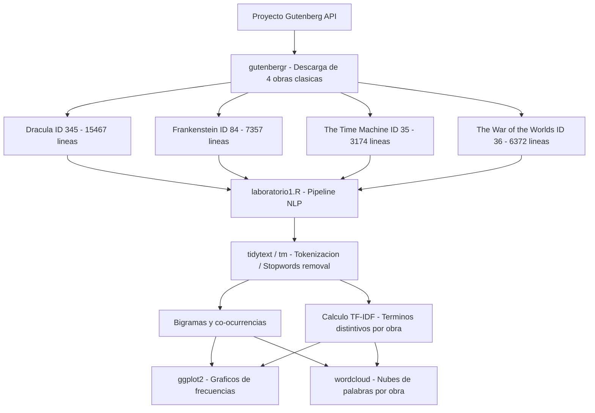

<h1 align="center">📚 Text Mining & NLP Analysis - Proyecto Gutenberg</h1>

<div align="center">


### 🚀 Análisis Avanzado de Texto sobre Clásicos de la Literatura Gótica y Ciencia Ficción

*Minería de texto aplicada a 4 obras maestras del Proyecto Gutenberg utilizando R y técnicas de NLP*

[🔍 Explorar el Análisis](#-análisis-realizado) • [📊 Resultados](#-resultados-destacados) • [💻 Código](#-instalación-y-uso) • [📖 Documentación](#-documentación)

---

**Autor:** Alejandro De Mendoza  
**Institución:** Fundación Universitaria Internacional de La Rioja  
**Curso:** Procesadores de Lenguajes (COLGII)  
**Fecha:** Febrero 2026

</div>

---

## 📖 Índice

- [Descripción General](#-descripción-general)
- [Obras Analizadas](#-obras-analizadas)
- [Tecnologías y Librerías](#️-tecnologías-y-librerías)
- [Análisis Realizado](#-análisis-realizado)
- [Resultados Destacados](#-resultados-destacados)
- [Instalación y Uso](#-instalación-y-uso)
- [Estructura del Proyecto](#-estructura-del-proyecto)
- [Visualizaciones](#-visualizaciones)
- [Hallazgos Clave](#-hallazgos-clave)
- [Documentación](#-documentación)
- [Contribuciones](#-contribuciones)
- [Licencia](#-licencia)
- [Contacto](#-contacto)

---

## 🎯 Descripción General

Este proyecto implementa un **pipeline completo de minería de texto y procesamiento de lenguaje natural (NLP)** aplicado a cuatro obras clásicas de la literatura gótica y de ciencia ficción obtenidas del Proyecto Gutenberg.

### 🔥 Características Principales

✨ **Análisis Comparativo Multi-libro** - Procesamiento simultáneo de 4 obras literarias  
📊 **Visualizaciones Avanzadas** - Gráficos de frecuencias, nubes de palabras y análisis TF-IDF  
🧠 **NLP Aplicado** - Tokenización, stopwords removal, bigramas y análisis de co-ocurrencias  
📈 **Métricas Estadísticas** - Cálculo de TF-IDF para identificación de términos distintivos  
🎨 **Código Profesional** - Documentado, modular y reproducible  

### 🎓 Objetivos del Proyecto

1. Demostrar dominio práctico de técnicas de minería de texto en R
2. Aplicar métricas estadísticas (TF-IDF) para caracterización temática
3. Comparar diferentes enfoques de análisis textual
4. Generar visualizaciones significativas de datos textuales
5. Identificar patrones léxicos y asociaciones semánticas

---

## 📚 Obras Analizadas

| Obra | Autor | Año | ID Gutenberg | Líneas | Género |
|------|-------|-----|--------------|--------|--------|
| **Dracula** | Bram Stoker | 1897 | 345 | 15,467 | Terror Gótico |
| **Frankenstein** | Mary Shelley | 1818 | 84 | 7,357 | Ciencia Ficción / Terror |
| **The Time Machine** | H.G. Wells | 1895 | 35 | 3,174 | Ciencia Ficción |
| **The War of the Worlds** | H.G. Wells | 1898 | 36 | 6,372 | Ciencia Ficción |

**Total:** 32,370 líneas | 331,182 palabras | 110,323 términos significativos

---

## 🛠️ Tecnologías y Librerías

### Lenguaje Base
- **R** (versión 4.5.2 o superior)

### Librerías Principales
```r
# Text Mining & NLP
library(gutenbergr)      # Descarga de textos del Proyecto Gutenberg
library(tidytext)        # Minería de texto con principios tidy
library(tm)              # Text Mining infrastructure

# Data Manipulation
library(dplyr)           # Gramática de manipulación de datos
library(tidyr)           # Organización de datos

# Visualización
library(ggplot2)         # Gráficos estadísticos elegantes
library(wordcloud)       # Generación de nubes de palabras
library(RColorBrewer)    # Paletas de colores profesionales
```

---

## 🔬 Análisis Realizado

### 1️⃣ **Adquisición y Preparación del Corpus**
- Descarga automatizada desde Gutenberg
- Unificación de textos en corpus único
- Validación de integridad de datos

### 2️⃣ **Tokenización y Limpieza**
```r
✓ 331,182 palabras tokenizadas
✓ 220,859 stopwords eliminadas (66.7%)
✓ 110,323 términos significativos conservados
```

### 3️⃣ **Análisis de Frecuencias**
- Top 15 términos por libro
- Visualización mediante gráficos de barras
- Identificación de patrones léxicos recurrentes

### 4️⃣ **Nubes de Palabras (Word Clouds)**
- 4 nubes individuales con paletas diferenciadas
- Visualización proporcional a frecuencia
- Comparación visual entre obras

### 5️⃣ **Análisis TF-IDF**
```
TF-IDF = Term Frequency × Inverse Document Frequency
```
- 26,192 términos evaluados
- Identificación de vocabulario distintivo
- Comparación entre frecuencia absoluta vs. distintividad

### 6️⃣ **Análisis de Bigramas**
- 309,133 bigramas generados
- 29,105 bigramas significativos (post-filtrado)
- Análisis de co-ocurrencias para términos clave

### 7️⃣ **Asociaciones Semánticas**
- **helsing** → 57 asociaciones identificadas
- **martians** → 33 asociaciones identificadas

---

## 📊 Resultados Destacados

### 🏆 Términos Más Característicos (TF-IDF)

#### Dracula
```
1. helsing    (0.00854)  ⭐ Personaje principal
2. lucy       (0.00633)  
3. mina       (0.00596)  
4. jonathan   (0.00514)  
5. van        (0.00916)  ⭐ Van Helsing
```

#### Frankenstein
```
1. elizabeth  (0.00400)  
2. clerval    (0.00300)  
3. justine    (0.00250)  
4. father     (0.00320)  
5. geneva     (0.00180)  
```

#### The Time Machine
```
1. morlocks   (0.00591)  ⭐ Criaturas futuras
2. weena      (0.00566)  
3. traveller  (0.00450)  
4. sphinx     (0.00380)  
```

#### The War of the Worlds
```
1. martians   (0.01000)  ⭐ Mayor TF-IDF del corpus
2. woking     (0.00750)  
3. mars       (0.00600)  
4. cylinder   (0.00500)  
```

### 💡 Insights Clave

🔍 **Frecuencia vs. Distintividad**
- Términos frecuentes ≠ Términos característicos
- TF-IDF revela vocabulario único por obra
- Nombres propios dominan análisis TF-IDF

🎭 **Patrones Narrativos**
- **Dracula**: Enfocado en personajes (helsing, lucy, mina)
- **Frankenstein**: Relaciones familiares (father, elizabeth)
- **Time Machine**: Conceptos futuristas (morlocks, traveller)
- **War of Worlds**: Invasión alienígena (martians, cylinder)

🔗 **Asociaciones Detectadas**
- "van helsing" → Bigrama más frecuente en Dracula
- "martians advancing" → Acción narrativa en War of Worlds
- Bigramas revelan contexto narrativo

---

## 💻 Instalación y Uso

### Prerrequisitos
```r
# Verificar versión de R (≥ 4.0.0 recomendado)
R.version.string

# Instalar librerías necesarias
install.packages(c(
  "gutenbergr", "tidytext", "dplyr", 
  "tidyr", "ggplot2", "wordcloud", 
  "RColorBrewer", "tm"
))
```

### Ejecución
```r
# 1. Clonar el repositorio
git clone https://github.com/tuusuario/text-mining-gutenberg.git
cd text-mining-gutenberg

# 2. Abrir RStudio y ejecutar el script principal
source("laboratorio1.R")

# 3. Los resultados se generarán automáticamente
# ✓ Gráficos en la ventana Plots
# ✓ Datos en el Environment
# ✓ Nubes de palabras visualizadas
```

### Uso Rápido
```r
# Ejecutar análisis completo en una sola línea
source("laboratorio1.R")

# Ver top 15 palabras más frecuentes
print(top_words)

# Ver términos más característicos (TF-IDF)
print(top_tf_idf)

# Ver asociaciones con "helsing"
print(helsing_assoc)
```

---

## 📁 Estructura del Proyecto
```
text-mining-gutenberg/
│
├── 📄 README.md                          # Este archivo
├── 📄 LICENSE                            # Licencia MIT
│
├── 📁 code/
│   ├── laboratorio1.R                    # Script principal (código completo)
│   └── funciones_auxiliares.R            # Funciones helper (opcional)
│
├── 📁 docs/
│   ├── Desarrollo_Proyecto.docx          # Informe completo (32 páginas)
│   └── presentacion.pdf                  # Presentación ejecutiva
│
├── 📁 results/
│   ├── graficos/
│   │   ├── frecuencias_por_libro.png     # Gráfico de frecuencias
│   │   ├── tfidf_por_libro.png           # Gráfico TF-IDF
│   │   └── wordclouds_4libros.png        # Nubes de palabras (2x2)
│   │
│   └── datos/
│       ├── top_words.csv                 # Top 15 palabras frecuentes
│       ├── top_tfidf.csv                 # Top 15 términos TF-IDF
│       └── bigramas_filtrados.csv        # Bigramas significativos
│
├── 📁 data/
│   └── corpus_procesado.rds              # Corpus guardado (opcional)
│
└── 📁 images/
    ├── banner.png                        # Banner del README
    └── workflow.png                      # Diagrama de flujo del análisis
```

---

## 🔑 Hallazgos Clave

### 🎯 Conclusiones Principales

1. **TF-IDF > Frecuencia Simple**
   - El análisis TF-IDF revela términos distintivos que la frecuencia oculta
   - Nombres propios dominan la caracterización temática
   - Cada obra tiene un vocabulario único identificable

2. **Stopwords Reduction Impact**
   - Eliminar 66.7% de palabras mejora significativamente el análisis
   - Las 110,323 palabras restantes contienen el significado real

3. **Patrones Narrativos por Género**
   - **Terror Gótico**: Enfocado en personajes y relaciones
   - **Ciencia Ficción**: Enfocado en conceptos y elementos tecnológicos

4. **Bigramas Revelan Contexto**
   - "van helsing" vs solo "helsing" proporciona más información
   - Las asociaciones capturan la narrativa en acción

5. **Visualizaciones Complementarias**
   - Gráficos cuantitativos + nubes cualitativas = análisis completo
   - Cada técnica aporta perspectivas diferentes

---

## 📖 Documentación

### 📚 Recursos Incluidos

- **Informe Completo** (32 páginas): Análisis detallado paso a paso
- **Código Documentado**: Cada bloque explicado en detalle
- **Resultados Reproducibles**: Todos los outputs verificables

### 🔗 Referencias

- [Proyecto Gutenberg](https://www.gutenberg.org/)
- [Tidytext Book](https://www.tidytextmining.com/)
- [R for Data Science](https://r4ds.had.co.nz/)
- [Text Mining with R](https://www.tidytextmining.com/)

### 📄 Publicaciones Relacionadas

- Silge, J., & Robinson, D. (2016). tidytext: Text Mining using 'dplyr', 'ggplot2', and Other Tidy Tools
- Feinerer, I., Hornik, K., & Meyer, D. (2008). Text Mining Infrastructure in R

---

## 🤝 Contribuciones

¡Las contribuciones son bienvenidas! Si quieres mejorar este proyecto:

1. 🍴 Fork el repositorio
2. 🌿 Crea una rama para tu feature (`git checkout -b feature/AmazingFeature`)
3. 💾 Commit tus cambios (`git commit -m 'Add some AmazingFeature'`)
4. 📤 Push a la rama (`git push origin feature/AmazingFeature`)
5. 🔀 Abre un Pull Request

### 💡 Ideas para Contribuir

- [ ] Añadir más libros al análisis
- [ ] Implementar análisis de sentimientos
- [ ] Crear dashboard interactivo con Shiny
- [ ] Análisis de n-gramas (trigramas, cuatrigramas)
- [ ] Modelado de tópicos (LDA)
- [ ] Comparación entre traducciones

---

## 📜 Licencia

Este proyecto está bajo la Licencia MIT - ver el archivo [LICENSE](LICENSE) para más detalles.
```
MIT License

Copyright (c) 2026 Alejandro De Mendoza

Permission is hereby granted, free of charge, to any person obtaining a copy
of this software and associated documentation files (the "Software"), to deal
in the Software without restriction...
```

---

## 📧 Contacto

**Alejandro De Mendoza**

- 🏛️ Fundación Universitaria Internacional de La Rioja
- 📧 Email: alejandro.mendoza.techengineer@gmail.com
- 💼 LinkedIn: https://www.linkedin.com/in/alejandro-de-mendoza-tovar-684318347/
- 🐙 GitHub: [@tuusuario](https://github.com/AlejoTechEngineer)

---

## 🙏 Agradecimientos

- **Profesor:** Ing. Rogerio Orlando Beltrán Castro
- **Institución:** Fundación Universitaria Internacional de La Rioja
- **Proyecto Gutenberg** por proporcionar acceso gratuito a obras literarias
- **Comunidad R** por las excelentes librerías de text mining
- **Autores:** Bram Stoker, Mary Shelley, H.G. Wells

---

## ⭐ Show Your Support

Si este proyecto te fue útil, ¡dale una ⭐ en GitHub!
```
⭐⭐⭐⭐⭐
```

---

<div align="center">

### 🚀 Hecho con ❤️ y mucho ☕ por Alejandro De Mendoza

**[⬆ Volver arriba](#-text-mining--nlp-analysis---proyecto-gutenberg)**

---

*Última actualización: Febrero 2026*

</div>
## Arquitectura


